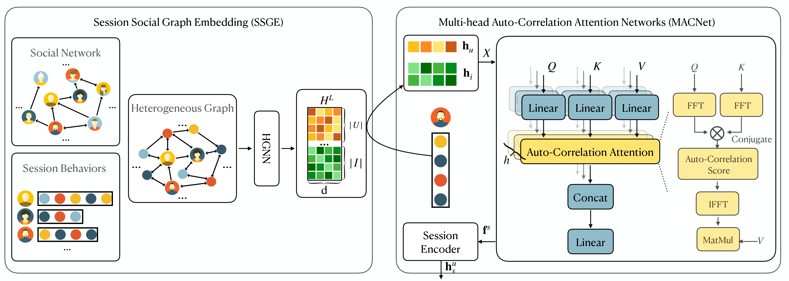

# MACNet
This repository contains the code for the paper "Multi-head Auto-Correlation Attention Networks for Session-based Social Recommendation".

## Framework


## Requirements
- python 3.9.13
- torch 1.10.1+cu111
- dgl-cuda10.2 0.9.1post1
- numpy 1.21.5
- pandas 1.4.4 
- faiss-gpu 1.7.3
- CUDA 12.0

## Usage
1. Install all the requirements.

2. Train and evaluate a model using the Python script [run.py](run.py).  
   For example, to train and evaluate the model MACNet on the *Gowalla* dataset, run the following command:
   ```bash
   sh scripts/run_gowalla.sh
   ```

   To see the detailed usage of `run.py`, run the following command:
   ```bash
   python run.py -h
   ```

   In the 'outputs' folder, you'll find the training log file, which records the details of the training process. 
   
   As an illustration, we've included [a log file](outputs/2023-11-19-20-56-50-gowalla-MACNet.txt) on the Gowalla dataset as an example.

## Dataset Format
You can train the models using your datasets. Each dataset should contain the following files:

- `stats.txt`: A TSV file containing three fields, `num_users`, `num_items`, and `max_len` (the maximum length of sessions). The first row is the header and the second row contains the values.

- `train.txt`: A TSV file containing all training sessions, where each session has three fileds, namely, `sessionId`, `userId`, and `items`. Both `sessionId` and `userId` should be integers. A session with a larger `sessionId` means that it was generated later (this requirement can be ignored if the used models do not care about the order of sessions, i.e., when the models are not DGRec). The `userId` should be in the range of `[0, num_users)`. The `items` field of each session contains the clicked items in the session which is a sequence of item IDs separated by commas. The item IDs should be in the range of `[0, num_items)`.

- `valid.txt` and `test.txt`: TSV files containing all validation and test sessions, respectively. Both files have the same format as `train.txt`. Note that the session IDs in `valid.txt` and `test.txt` should be larger than those in `train.txt`.

- `edges.txt`: A TSV file containing the relations in the social network. It has two columns, `follower` and `followee`. Both columns contain the user IDs.

You can see [datasets/gowalla](datasets/gowalla) for an example of the dataset.


## Acknowledgment

Training pipeline are implemented based on [SEFrame](https://github.com/twchen/SEFrame). Thanks them for providing efficient implementation.
